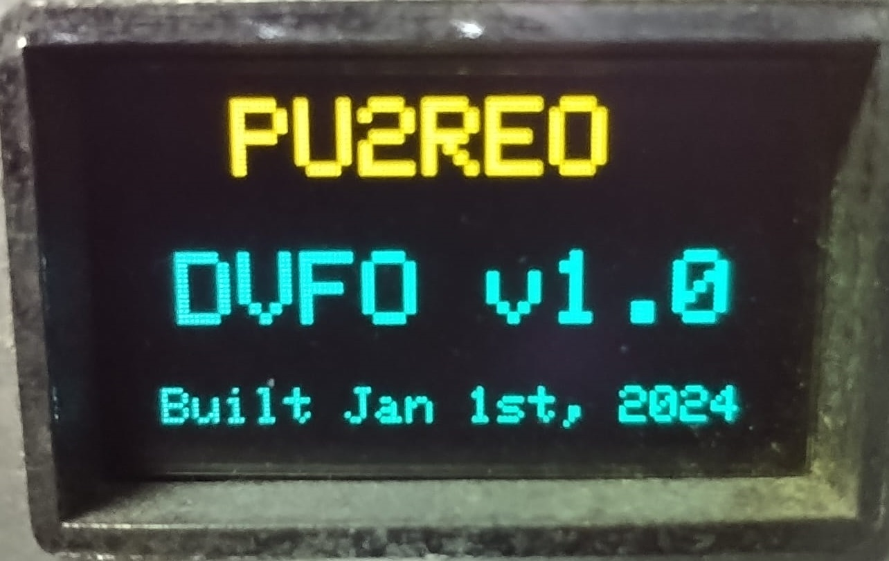
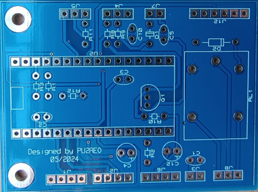
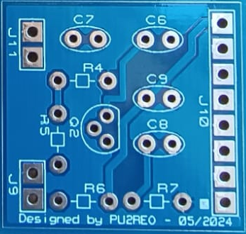
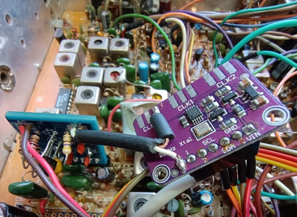
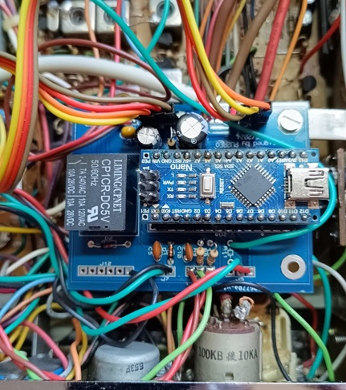

# PU2REO_DVFO
Digital Variable Frequency Oscillator to be applied to Citzen Band/Amateur Radio transceivers, using SkyWorks' Si5351 programmable any-frequency CMOS clock generator.

# Preface
The Si5351 is an I2C configurable clock generator that is ideally suited for replacing crystals, crystal oscillators, VCXOs, phase-locked loops (PLLs), and fanout buffers in cost-sensitive applications.
With that in mind and having at hand an old CB radio with PLL/VCO problems, I decided to design something digitally controlled to put my old gear back on its feet again.

# Things/Tools I used in this project
- Arduino Nano Clone [like this](https://www.google.com/search?q=aliexpress+arduino+nano);
- Cheap Si5351 Module [like this](https://www.google.com/search?q=aliexpress+Si5351+module);
- SSD1306 OLED Display Module [like this](https://www.google.com/search?q=aliexpress+ssd1306+oled+display+arduino);
- USBasp Arduino Programmer Module [like this](https://www.google.com/search?q=aliexpress+arduino+usbasp+programmer). This one is mostly needed to remove the boatloader present in all Arduino Modules. At the end, we will run pretty short on memory, the boatloader is not needed and causes a collateral effect (See sketch comments for details);
- A piece of Single Side Prototype PCB Breadboard;
- 1mm wire for connections;
- Some cheap electronic components (Pots, Resists, Caps, 1 Digital Encoder with push button, 1 Relay for RogerBeep commuting).

# Disclaimer
All the things described below requires specific knowlege in Analogic Eletronics applied to CB Radios and its operating modes, programming, schematics reading and interpretation, soldering and removal of soldered components. So, **decide to do it or not at your own risk**. You can easily burn out your equipment or damage it beyond the reparing, and I cannot be held reponsible for it.

# Operating mode (Specific knowledge required on CB Radios operational mode) of this device
The PU2REO_DVFO operational mode is quite simple: We simply remove all the electronic circuitry related to frequency generation, in this case for a CB radio, in exchange for the DVFO, taking into consideration the [Intermediate Frequency](https://en.wikipedia.org/wiki/Intermediate_frequency) commonly present in almost all CB Radios, altogether with frequency shifting for [Single Side Bands](https://en.wikipedia.org/wiki/Single-sideband_modulation).

#### Example: Lets talk about [Channel 40](https://www.fcc.gov/wireless/bureau-divisions/mobility-division/citizens-band-radio-service-cbrs), Frequency 27.405 MHz, considering:
  - Intermediate Frequency of the Radio: 7.8 Mhz;
  - SSB Shifiting: +1500 Hz (USB) and -1500 Hz (LSB);
  - AM - **no shifting**

That said, we just have to do some math: **Si5351 Output Frequency = Base Channel Frequency + Intermediate Frequecy + SSB shifting frequency**.

So, taking into consideration Channel 40 frequency, we will have to set at Si5351 output at these frequencies, and inject them at the output point of the removed VFO into the radio:
  * **AM Modulation:** 35.2055 Mhz
  * **LSB Modulation:** 35.2040 Mhz
  * **USB Modulation:** 35.2070 Mhz

(I won't go further with CB radios right now, since it's not the subject here. Maybe in the near future, I'll update this file with detailed information on how I used this device on my own radio!!)

# Features present in this device
These are the implemented features so far, taylored for my old [Cobra 148GTL](https://www.rigpix.com/cbfreeband/cobra_148gtl_older.htm), but easily adaptable to any other radio:
  - Progamable Frequency Generator via Arduino/Si5351;
  - Digital TX/RX controller;
  - Digital RogerBeep;
  - VoiceLock actuating directly on frequency generation via Analog Input;
  - Adjustables IF Frequency, LSB & USB offset, Voice Lock Range, RogerBeep;
  - Channels and Direct Frequency Modes;
  - S-Meter on display, via Analog Input;

# Detailed information
[PU2REO DVFO - User Manual v1.5.pdf](Documents/PU2REO%20DVFO%20-%20User%20Manual%20v1.5.pdf "PU2REO DVFO - User Manual v1.5.pdf")

# Features not implemented yet
  - HF receiver for 40m band;
  - HF receiver board.

# Pictures - Crude PCB and Assembled

# See it in action :heart_eyes:

# How to help?
  - Give me a star and it will empower my good spirits to move on further.
  - When using it or modifying it, please, refer to original source files and author. It will be, at least, polite.
  - Don't ask for personal modifications (Like CW and FM modulation modes: there's no secret in these modes and, if you know your ways in electronics and programming, you can do it by yourself).
  - Please, don't sell it: I made it as a hobby, not for money.
  - Feel free to contribute in anyway. All new ideas are welcomed.

# History
  - 1.0 – Initial version
  - 1.1 – New pictures into the manual, minor correction to the schematics; Improvement on EEPROM saving routine.
  - 1.2 - Fixed channel mode power-on frequency; Single or Two-tone Roger Beep; Removed extra code managing EEPROM savings.
  - 1.3 - (not released)
  - 1.4 - Removed Two-Tone Roger Beep and added a Special One (to my granddaughter!); Map function on voice lock;  Fixed voice lock range issue (AInput does not reach value 1024); Minor improvements.
  - 1.5 - Blink Nano LED in case of Si5351/Display error; Cyclic VFO (After SI5351_MAX_FREQ returns SI5351_MIN_FREQ and vice-versa); Cyclic Channels  (After VFO.ChannelIndex > (MAX_CHANNEL_INDEX-1), VFO.ChannelIndex returns to zero and vice-versa); Optimized EEPROM readings/savings by block.

